# Power BI Data Analytics Portfolio

**Tools Used:** Power BI Desktop | Microsoft Excel | DAX | Power Query

---

## About This Project

This portfolio showcases end-to-end data analytics skills using Power BI. It covers two real-world datasets — a **Finance/Sales dataset** and a **Superstore dataset** — with interactive dashboards built from scratch, including data cleaning, data modeling, DAX measures and business insight generation.

---

## Dashboard Pages

### 1. Finance Dashboard — Overview
A high-level summary of financial performance with key metrics and slicers for country-level filtering.

**KPIs:** Total Sales: 118.73M | Total Profit: 16.89M | Total Discounts: 9.21M

**Visuals included:**
- Product-wise Sales (Bar Chart)
- Country-wise Sales (Donut Chart)
- Month-wise Sales (Line Chart)
- Segment-wise Sales (Horizontal Bar Chart)
- Country Slicer for dynamic filtering

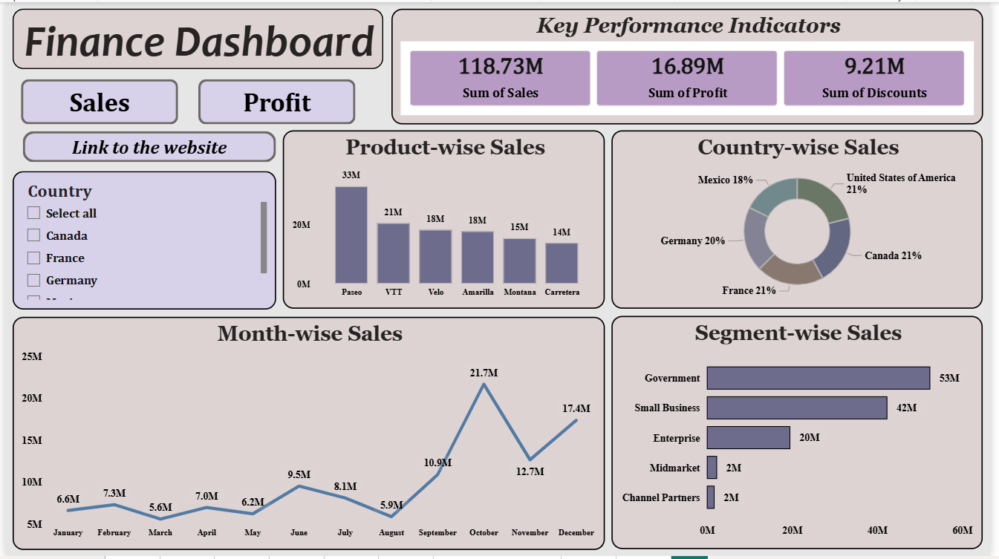

---

### 2. Finance Dashboard — Sales & Profit Trends
A drillable time-intelligence page with toggle buttons for Year, Quarter and Month views.

**Visuals included:**
- Sales, COGS & Profit by Year
- Sales, COGS & Profit by Quarter
- Sales, COGS & Profit by Month (Grouped Bar Chart)

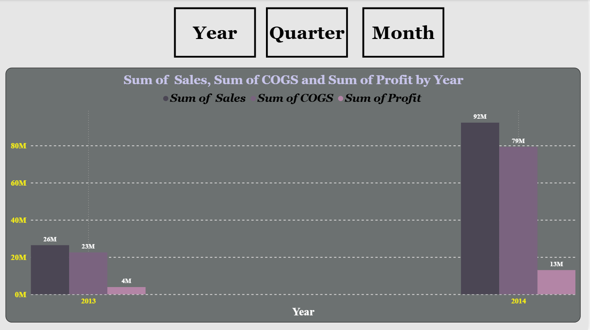
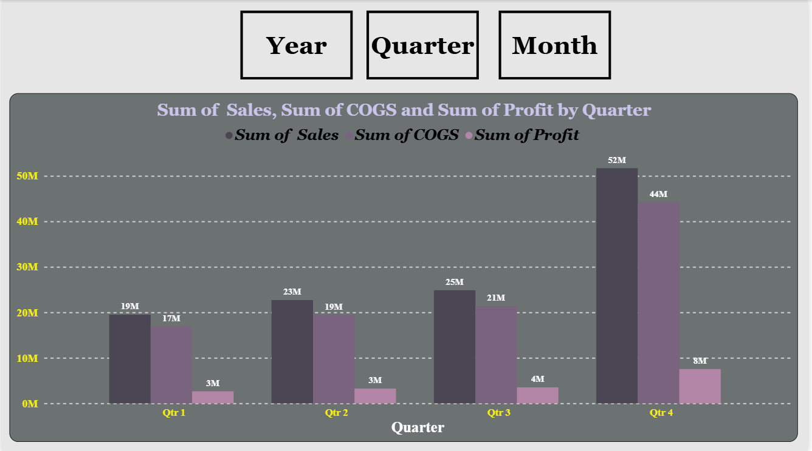
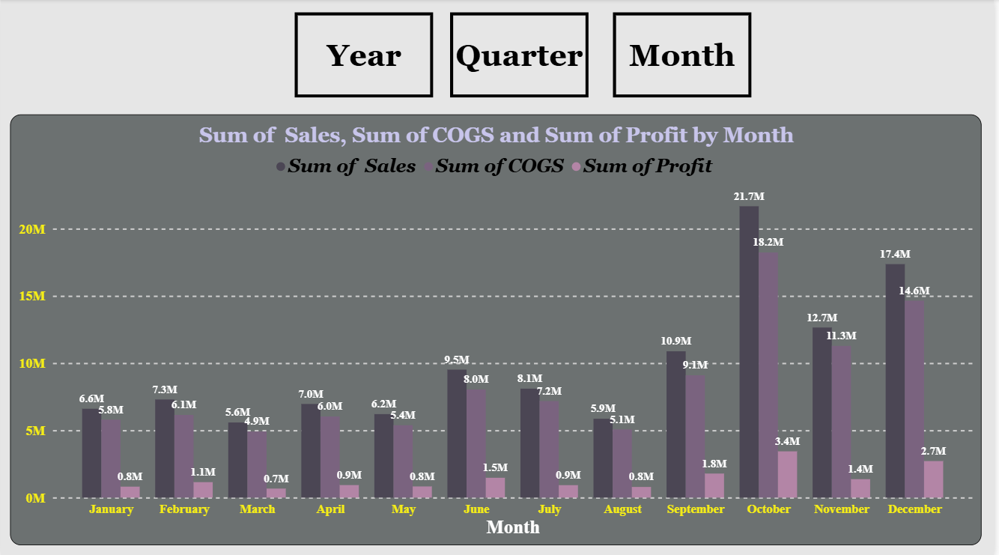

---

### 3. Region-wise Profit (with Drill-through)
A donut chart showing profit distribution across 4 regions — West (37.9%), East (32%), South (16.3%), Central (13.9%) — with drill-through enabled to region-specific detail pages.

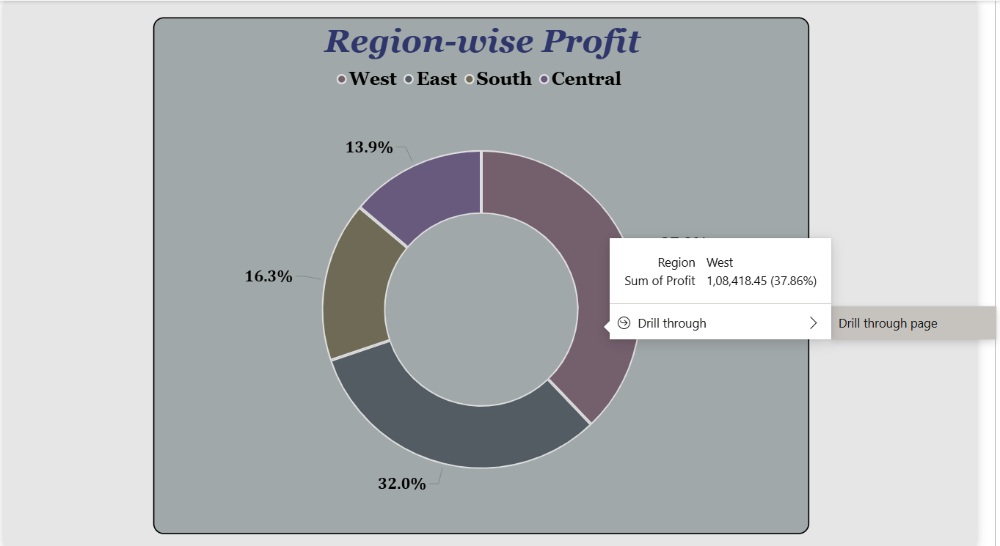

---

### 4. West Region Drill-through Page
Detailed breakdown for the West region accessible via drill-through from the Region-wise Profit chart.

**KPIs:** Sales: 725.46K | Profit: 108.42K | Quantity: 12K

**Visuals included:**
- Category-wise Profit (Pie Chart)
- Sub Category-wise Profit (Bar Chart)
- City-wise Sales (Horizontal Bar Chart — top city: Los Angeles at 176K)
- Month-wise Sales (Line Chart)

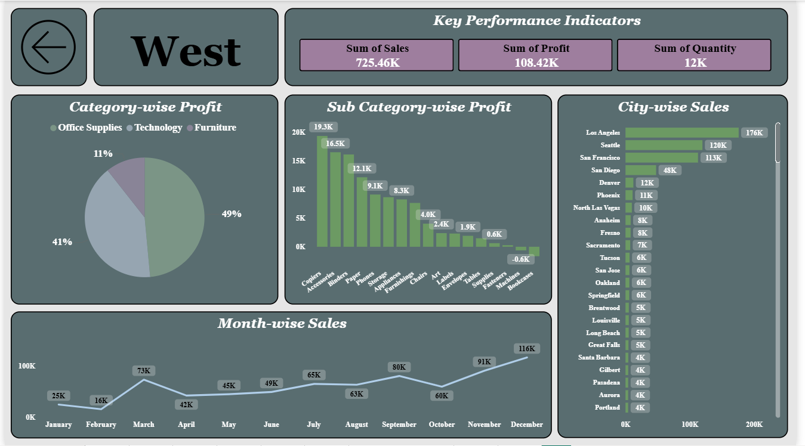

---

### 5. Superstore — Sub-Category Performance Table
A detailed matrix visual with conditional formatting showing profitability at a glance.

**Metrics:** Sales, Profit (with ↑↓ indicators), Quantity, Discount per sub-category

**Top performers:** Phones (3,30,007), Chairs (3,28,449), Storage (2,23,844)

**Loss-making sub-categories:** Tables (-17,725 profit), Bookcases (-3,473), Supplies (-1,189)

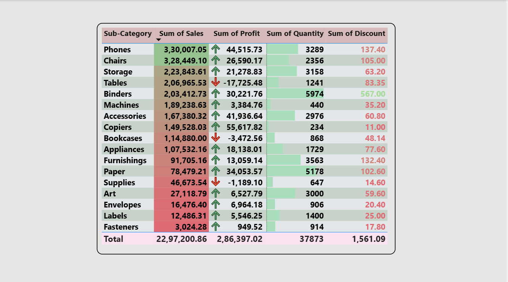

---

### 6. Geographic Sales Breakdown
A hierarchical drill-down matrix showing sales by Country → State → Region → City → Postal Code with conditional color formatting on values.

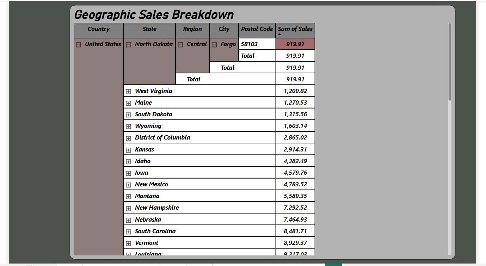

---

### 7. Yearly Sales by Category (Waterfall Chart)
A waterfall chart visualizing cumulative sales changes across years and categories — Technology, Furniture and Office Supplies — with increase/decrease color coding.

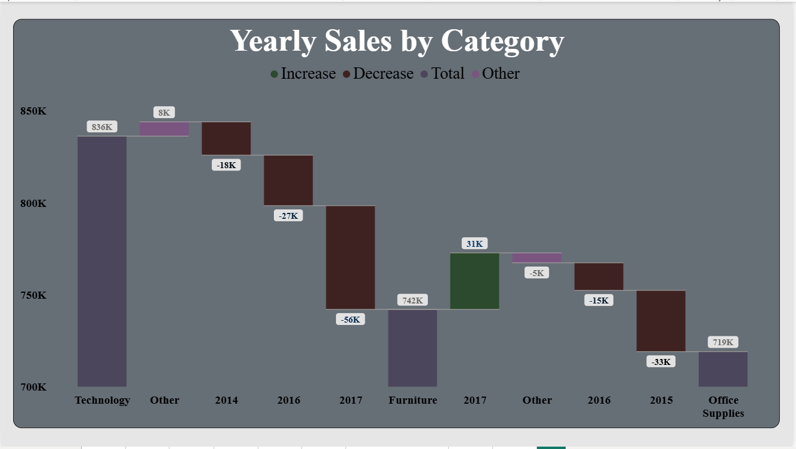

---

### 8. Sales Performance Overview (YoY Comparison)
A combo chart comparing current year vs last year sales with a Growth % line overlay across 2014–2017.

**Insight:** Sales peaked in 2017 at 0.73M with 20.4% growth, while 2015 saw a -2.8% dip.

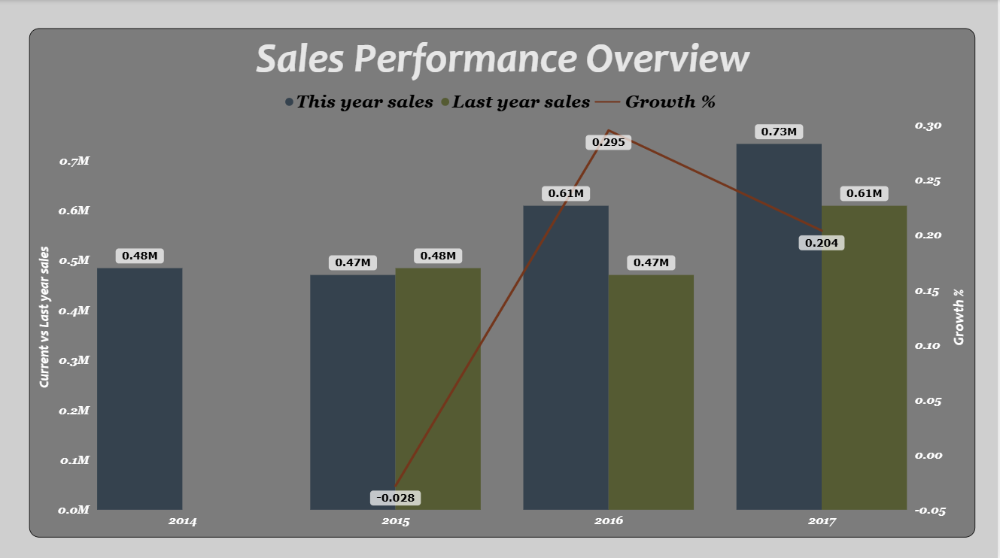

---

### 9. Power BI Theory — Q&A Page
A conceptual reference page covering Power BI fundamentals including its definition and the 5 platforms: Desktop, Service, Mobile, Report Server and Embedded.

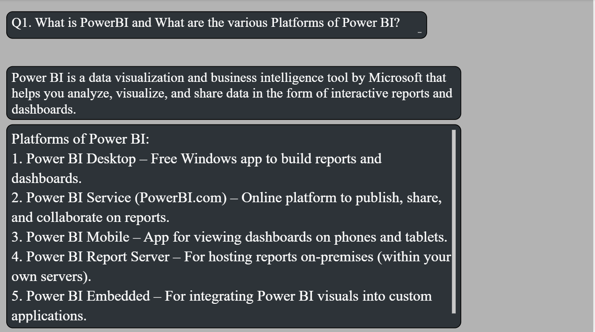

---

## 🛠️ Skills Demonstrated

| Skill | Details |
|---|---|
| **Data Cleaning** | Removed nulls, standardized formats using Power Query |
| **Data Modeling** | Built table relationships across fact and dimension tables |
| **DAX** | Created calculated columns, measures (YoY Growth, Profit %, COGS) |
| **Time Intelligence** | Year/Quarter/Month toggle using DAX & bookmarks |
| **Drill-through** | Region-level drill-through pages |
| **Conditional Formatting** | Color-coded profit/loss indicators in matrix visuals |
| **Interactivity** | Slicers, filters, bookmarks, navigation buttons |

---

## 💡 Key Business Insights

- **October** is consistently the highest revenue month (21.7M in Finance dataset)
- **Government** segment contributes the most sales (53M), followed by Small Business (42M)
- **West region** is the most profitable at 37.9% of total profit
- **Tables, Bookcases & Supplies** are loss-making sub-categories that need pricing review
- **Phones and Chairs** are top-selling sub-categories in the Superstore dataset
- Sales grew 29.5% YoY in 2016 then moderated to 20.4% in 2017

---

## 📬 Connect with Me

- **GitHub:** [github.com/purvidawra](https://github.com/purvidawra)
- **LinkedIn:** https://www.linkedin.com/in/purvi-dawra/
- **Email:** poorvidawra925@gmail.com

---

*This project was completed as part of a Power BI course assignment, demonstrating practical data analytics and visualization skills.*
